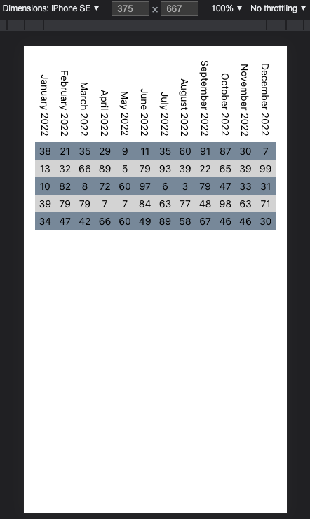

# How to create vertical table headers

Finally a reasonable way to implement vertical table headers. Usually when I google the issue I end up with "position: absolute + transform" kind of solution, which is problematic as it makes layout super difficult.

Technologies used:

- React with TypeScript
- Plain CSS files imported to React
- writing-mode CSS rule

## Initial setup and configuration

1. Create a new React app with `npx create-react-app . --template typescript`
2. Start dev server using `npm start`

## The problem

Tables are still a valid way to visualise data, wether it is financial data or a feature matrix on your product page. A common problem is easy to spot on mobile devices, the space is rather limited and you need to make your tables compact. Even if you manage to reduce amount of columns, the column headers often take a lot of space (in horizontal dimension).

The usual way to solve the problem is to rotate the text using `transform` CSS rule, but it makes positioning the text rather difficult and it is in my opinion incomplete solution if you have multilined headers.

## The solution

I don't know why I haven't seen it before, but I just recently found a new CSS rule `writing-mode` (check more from [MDN](https://developer.mozilla.org/en-US/docs/Web/CSS/writing-mode)).

It is very simple rule that allows you to change writing mode from default (`horizontal-tb`) to either `vertical-rl` or `vertical-lr`. The difference it on how multi-lined content is handled.

The rules also has experimental values `sideways-rl` and `sideways-lr` to change direction text is read from. But these values are not supported widely yet.

As for my demostration, I added table styles to `App.css`, with the point in this rule set:

```css
th {
  font-weight: 400;

  /* do not wrap text */
  white-space: nowrap;

  /* make it vertical, finally! */
  writing-mode: vertical-lr;

  /* make sure the text are aligned to "right" which in this case is "bottom" */
  text-align: right;

  /* just some padding, a slightly bigger on the bottom */
  padding: 0.25rem 0.25rem 0.5rem 0.25rem;
}
```

All the other rules in the css file are just for decoration.

## Summary

The solution is rather simple and it works nicely on all the major browsers. Also, I don't need to play around with complicated `transform` rule.

My demo table has 12 columns, even on the narrow iPhone simulation. Of course the layout hugely depends on table contents etc, but using `writing-mode` you can make sure the table headers won't take up most of the space.



**Feel free to browse the code, if you have any questions or improvement ideas let me know!**

## Author

Timo Kallela, for more information please visit my [GitHub profile](https://github.com/kallelat)

You can also contact me by [email](mailto:timo.kallela@gmail.com) or via [LinkedIn](https://www.linkedin.com/in/kallelat/)!

## License

Contents of this repository is licensed under [MIT](LICENSE) license.
